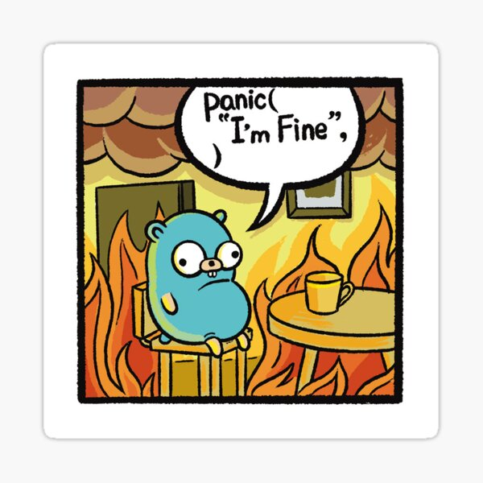

# GOGO Dancers Project for course 4IT428 - Vývoj mikroslužeb v jazyce Go

The goal of the project is still unknown to me, I read the assigment long time ago. But this is the base for it.

## Assignment

You can see the assignment [here](assignment.pdf).

## Run the code

```bash
  go run main.go
```

## Stack

routing - [chi](https://github.com/go-chi/chi)

## Contributing

Please follow rules in [CONTRIBUTING.md](./CONTRIBUTING.md)

## Let's GO!



## Links

[Lecture repo](https://github.com/strvcom/backend-go-vse-microservice-development)
